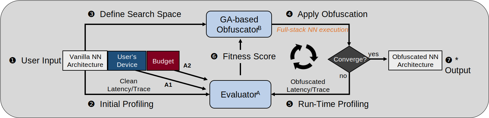
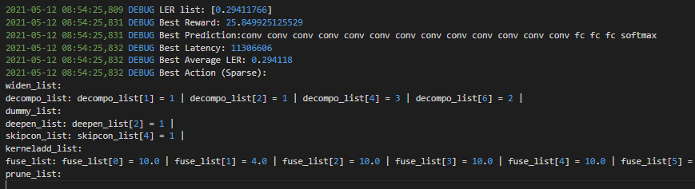
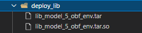

# NeurObfuscator (DNN Architecture Obfuscator)



## [Disclaimer update: 06/17/2022](#disclaimer-1)

## Description

(This work is to appear in HOST 2021! Cleaned-up version/Documentary for detailed usage will be updated soon.)

**NeurObfuscator** is a full-stack obfuscation tool to obfuscate the neural network architecture while preserving its functionality with very limited performance overhead. 

At the heart of this tool is a set of obfuscating knobs, including layer branching, layer widening, selective fusion and schedule pruning, that increase the number of operators, reduce/increase the latency, and number of cache and DRAM accesses.

A genetic algorithm-based approach is adopted to orchestrate the combination of obfuscating knobs to achieve the best obfuscating effect on the layer sequence and dimension parameters that both architecture secrets cannot be extracted successfully. 

Results on sequence obfuscation show that the proposed tool obfuscates a ResNet-18 ImageNet model to a totally different architecture (with 44 layer difference) without affecting its functionality with only 2\% overall latency overhead. 

For dimension obfuscation, we demonstrate that an example convolution layer with 64 input and 128 output channels is extracted to 207 input and 93 output channels with only a 2\% latency overhead.


## Documentation

### <ins>**Install NVIDIA docker**<ins> 
    
Follow the instruction below to install the NVIDIA docker.

https://docs.nvidia.com/datacenter/cloud-native/container-toolkit/install-guide.html#docker

On Linux, you should also [enable Docker CLI for the non-root user account](https://docs.docker.com/engine/install/linux-postinstall/) that will be used to run VS Code. (Otherwise, you have to use sudo all the time with docker command.)
    
### <ins>**Pull Pre-build Docker Image**<ins> 

```
docker pull zlijingtao/neurobfuscator:lastest
docker tag zlijingtao/neurobfuscator:lastest neurob
```
    
### <ins>**(Alternative) Build Docker Image**<ins> 
    

```
docker build -t neurob .
```

PS: This could be a slow building process.


### <ins>**Test the Tool**<ins>

Test the tool using provided ``run.sh`` script to go through all necessary steps of NeurObfuscator. This includes: 

1) Dataset Generation 
2) Sequence Predictor Training 
3) Sequence Predictor Validation
4) Sequence Obfuscation
5) Dimension Predictor Training 
6) Dimension Predictor Validation
7) Dimension Obfuscation

```
docker run --gpus all -it neurob
bash run.sh
```

#### **Expected Results**:

The log file is saved under ``./seq_obfuscator/``, a snapshot of the result:



where, we applied several sequence obfuscating knobs and achieves a LER of ``0.294``. (This is a toy example.)

The compiled runtime for the obfuscated model is saved under ``./seq_obfuscator/deploy_lib/``



#### <ins>**Known Issues**<ins>

Unfortunately, some systems may fail to execute ``relay.build`` in a docker environment - throwing ``segmentation fault`` error. This can be circumvented by building a local environment. That is, setting up all necessary tools and library scripted in the Dockerfile in your local machien without using docker. This can be a tedious process.

### <ins>**Real Use Case**<ins>

To use the tool in practice, first, you need script/coding the original neural network model following the tutorial in the tempalte ``./seq_obfuscator/model_file/model_template.py`` and properly label it using ``label_maker.py`` in the same directory. (*We currently only supports a specific format, need to match the format as other example networks in this directory*)

Importantly, a reasonable large parameter need to be set by simply re-commenting and run the ``run above`` setting we provide. (*need to check all scripts*)

```bash
# your_model_id=
# your_budget=
# budget_list=(${your_budget})
# nn_id_list=(${your_model_id})
# restore_step=149
# num_predictor_model=5
# predict_type=all
# n_pop=16
# n_generation=20
#Run below for testing, run above for bagging of 15 LSTM predictors
budget_list=(0.20)
nn_id_list=(4)
restore_step=49
num_predictor_model=1
predict_type=full
n_pop=4
n_generation=2
```

After re-commenting, you need to set a budget in ``./scripts/seq_obfuscate_cifar.sh`` (as an example). Suppose your model_id is ``15`` and budget is ``0.20``.

```bash
your_model_id=15
your_budget=0.20
budget_list=(${your_budget})
nn_id_list=(${your_model_id})
restore_step=149
num_predictor_model=5
predict_type=all
n_pop=16
n_generation=20
#Run below for testing, run above for bagging of 15 LSTM predictors
# budget_list=(0.20)
# nn_id_list=(4)
# restore_step=49
# num_predictor_model=1
# predict_type=full
# n_pop=4
# n_generation=2
```
### <ins>**(Extra) Test the Tool Performance against Adversarial Attacks**<ins>

#### **If you build your own docker**:

Download the model from here:

https://drive.google.com/drive/folders/1UDDFvnbWdP1nXZEUjBHo1id-eBt6620c?usp=sharing

(Before building the dockerfile) Copy them to ``./test_attack/``, after build and login to the container:
```
bash test_attack.sh
```
#### **If you pull the pre-build one**:
```
cd test_attack
bash test_attack.sh
```

The results will be saved under ``./test_attack/attack_result/``.

    
    
### <ins>**Details that miss in the paper**<ins>
#### **Detail of obfuscation**
Model-B (extravgg_3)
```python
decompo_list = [0, 0, 2, 4, 0, 4, 4, 0, 1, 4, 3] 
deepen_list = [0, 1, 0, 1, 0, 0, 0, 0, 0, 0, 0]
```
Model-C (newvgg_9)
```python
decompo_list = [0, 0, 2, 4, 0, 4, 4, 0, 1, 4, 3] 
deepen_list = [0, 1, 0, 1, 0, 0, 0, 0, 0, 0, 0]
widen_list = [1.5, 1, 1.5, 1, 1.5, 1, 1, 1, 1, 1, 1]
kerneladd_list = [1, 0, 1, 0, 1, 0, 0, 0, 0, 0, 0]
```

#### **Detail of Metrics Selection for Cases A/B/C**
```
  Metrics {
    Label: "Cycles"
    Name: "sm__cycles_active.sum"
  }
  Metrics {
    Label: "Mem Read"
    Name: "dram__sectors_read.sum"
  }
  Metrics {
    Label: "Mem Write"
    Name: "dram__sectors_write.sum"
  }
  Metrics {
    Label: "L1/TEX Hit Rate"
    Name: "l1tex__t_sector_hit_rate.pct"
  }
  Metrics {
    Label: "L1 Utilization"
    Name: "l1tex__lsu_writeback_active.avg.pct_of_peak_sustained_active"
  }
  Metrics {
    Label: "L1 Read Transactions"
    Name: "l1tex__t_sectors_pipe_lsu_mem_global_op_ld.sum"
  }
  Metrics {
    Label: "L1 Write Transactions"
    Name: "l1tex__t_sectors_pipe_lsu_mem_global_op_st.sum"
  }
  Metrics {
    Label: "L2 Utilization"
    Name: "lts__t_sectors.avg.pct_of_peak_sustained_elapsed"
  }
  Metrics {
    Label: "L2 Hit Rate"
    Name: "lts__t_sector_hit_rate.pct"
  }
  Metrics {
    Label: "L2 Read Transactions"
    Name: "lts__t_sectors_op_read.sum"
  }
  Metrics {
    Label: "L2 Write Transactions"
    Name: "lts__t_sectors_op_write.sum"
  }
```
    
<!-- 

## **Mannual Setup** (Not Recommended, cost hours and could result in failure)

### **0. Install CUDA in a linux machine**

CUDA >= 11.0
cudnn >= 8.0

### **1. Install TVM**

Install LLVM from https://apt.llvm.org/ (we use LLVM-10)

Before running the scripts we provide here. Your File Structure should look like this:
```
----${USER} (your home directory)

    ---- tvm

    ---- torch_profiling (This repository)
```

Clone the tvm into your home directory. Then checkout 58c3413a3 version of the lastest TVM repository:

```
$ cd /usr && \
     git clone https://github.com/apache/incubator-tvm.git tvm --recursive && \
     cd ~/tvm && \
     git checkout 58c3413a3 && \
     mkdir build && \
     cp cmake/config.cmake build
```

And Copy the required file to support ``selective Fusion'' as described in our paper. Then build with USE_CUDA and USE_LLVM (llvm version must be the same with yours)

```
$ cp -r ~/torch_profiling/copy2tvm/tvm ~/
$ cd /usr/tvm/build && bash -c \
     "echo set\(USE_LLVM llvm-config-10\) >> config.cmake && \
     echo set\(USE_CUDA ON\) >> config.cmake" && \
     cmake .. && \
     make -j4 
```

Last but not the least, add to your path:
```
export TVM_HOME=~/tvm
export PYTHONPATH=$TVM_HOME/python:${PYTHONPATH}
```

### **2. Setup Python Enviroment**

We recommend using conda. 


Require python version == 3.6, and use pip to install library listed below:
```
pip install pylint==1.9.4 six numpy pytest cython decorator scipy tornado torch==1.7.1+cu110 torchvision==0.8.2+cu110 torchaudio==0.7.2 -f https://download.pytorch.org/whl/torch_stable.html tensorflow==1.13.1
```

### **3. Install Nsight Compute**

#### Install either using command below in ubuntu-based Linux or directly from NVIDIA, 2020.3.0 version is required in either case.
```
sudo apt-get update -y && \
     DEBIAN_FRONTEND=noninteractive apt-get install -y --no-install-recommends \
         apt-transport-https \
         ca-certificates \
         gnupg \
         wget && \
     rm -rf /var/lib/apt/lists/*
sudo echo "deb https://developer.download.nvidia.com/compute/cuda/repos/ubuntu1804/x86_64 /" > /etc/apt/sources.list.d/cuda.list && \
     wget -qO - https://developer.download.nvidia.com/compute/cuda/repos/ubuntu1804/x86_64/7fa2af80.pub | apt-key add - && \
         apt-get update -y && \
     DEBIAN_FRONTEND=noninteractive apt-get install -y --no-install-recommends \
         nsight-compute-2020.3.0 && \
     rm -rf /var/lib/apt/lists/*


```
#### (IMPORTANT!) To enable the profiler:

##### Permanent Option:
```
sudo touch /etc/modprobe.d/nvprof.conf
```
Then copy this line 'options nvidia "NVreg_RestrictProfilingToAdminUsers=0"' to nvprof.conf
```
sudo update-initramfs -u
```
A reboot is needed to enable sudo-free profiling.


##### Running into any problem for a sudo-free profiling, please follow the instruction below:

https://developer.nvidia.com/nvidia-development-tools-solutions-err_nvgpuctrperm-permission-issue-performance-counters


#### Add path to ~/.bashrc ("/usr/local/NVIDIA-Nsight-Compute" or "/opt/nvidia/nsight-compute/2020.3.0" is available after install the nsight compute software, in either case, make sure ``ncu'' is in that directory)
```
export PATH="/opt/nvidia/nsight-compute/2020.3.0:$PATH"
```
or
```
export PATH="/usr/local/NVIDIA-Nsight-Compute:$PATH"
```


### **4. Add Trace Section to NVcompute**

We provide a sepcial Trace Section, please move it into customizable Trace Section folder of 

**(if using ncu 2020.3.0)** cp torch_profiling/ncu_section/ImportantTraceAnalysis.section ~/Documents/NVIDIA Nsight Compute/2020.3.0/Sections/ -->

<h3 id="#disclaimer">Disclaimer</h3>

